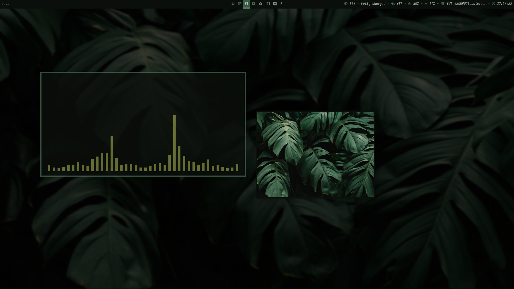

# dotfiles
## Screenshot



# Setup libinput
This section is the breakdown of the [archwiki](https://wiki.archlinux.org/title/Libinput)

First __symlink__ the default libinput configuration  `40-libinput.conf`
> Note: should be a root user
```bash
ln -s /usr/share/X11/xorg.conf.d/40-libinput.conf /etc/X11/xorg.conf.d/40-libinput.conf
```
## Custom configuration file
create `30-touchpad.conf` under `/etc/X11/xorg.conf.d/` and add the following
configuration to the file and save it.
> Note: you might want to restart X for changes to take effect.
```config
Section "InputClass"
	Identifier "touchpad"
	Driver "libinput"
	MatchIsTouchpad "on"
	Option "Tapping" "on"
	Option "TappingButtonMap" "lrm"
	Option "ClickMethod" "clickfinger"
	Option "NaturalScrolling" "true"
EndSection
```

# Fix sound
| `Package(s)`      | `Link`                                                       | `Description`               |
| ----------------- | ------------------------------------------------------------ | --------------------------- |
| `pulseaudio`      | [PulseAudio](https://wiki.archlinux.org/title/PulseAudio)    | `pacman -S pulseaudio`      |
| `pulseaudio-alsa` | [pulseaudio-alsa](https://archlinux.org/packages/?name=pulseaudio-alsa) | `pacman -S pulseaudio-alsa` |
| `alsa-utils`      | [ALSA](https://wiki.archlinux.org/title/Advanced_Linux_Sound_Architecture) | `pacman -S alsa-utils`      |


# Fonts

For more info visit [archwiki](https://wiki.archlinux.org/title/fonts)

`nerd-fonts-anonymous-pro`
`nerd-fonts-cascadia-code`
`nerd-fonts-fira-code`
`nerd-fonts-inconsolata-go`
`nerd-fonts-victor-mono`
`noto-fonts`
`noto-fonts-emoji`
`ttf-nerd-fonts-hack-complete-git`

## Installing powerline fonts

If your powerline status bar is not showing properly, it is possible that you 
do not have powerline fonts installed.

```bash
git clone --depth 1 https://github.com/powerline/fonts.git powerline-fonts
cd powerline-fonts
./install.sh
cd ..
rm -rvf powerline-fonts
```

# Neovim

## Python 3 provider

### From github: how to install neovim python module \#8085

```bash
pip install --user neovim
```
> Visit [neovim issue](https://github.com/neovim/neovim/issues/8085) for more

# Polybar
## No glyphs shown
You need to install __nerd fonts__ in order for glyphs to work properly.
